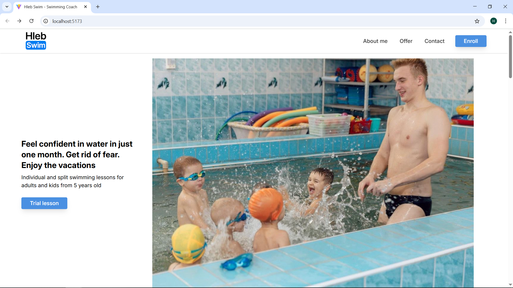
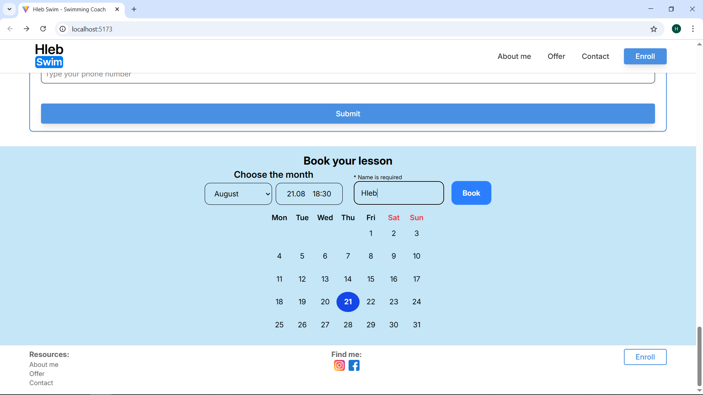
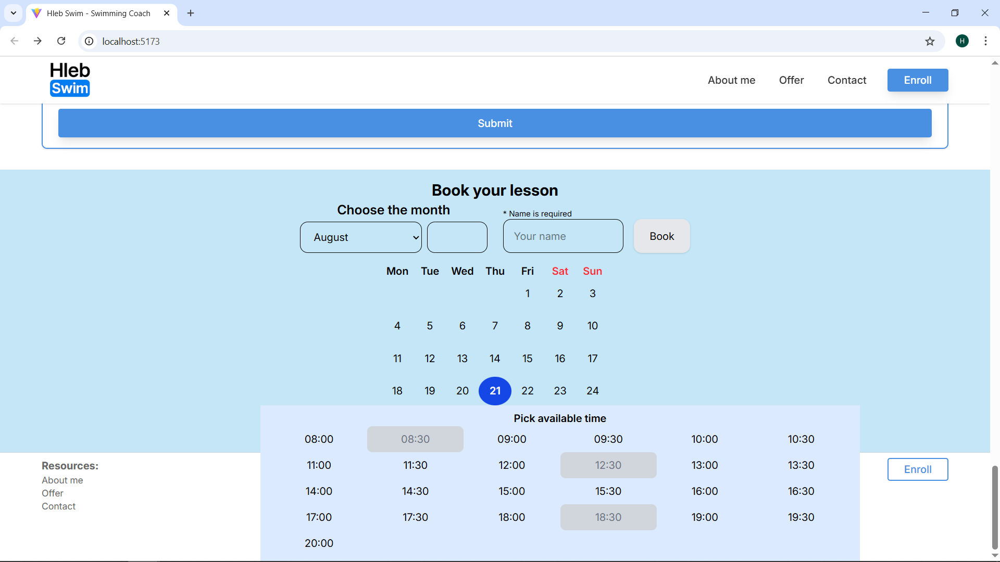
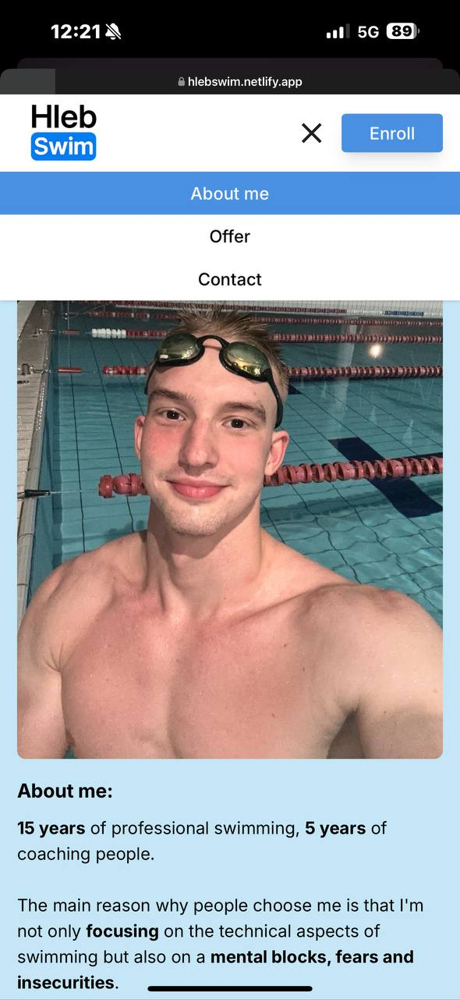
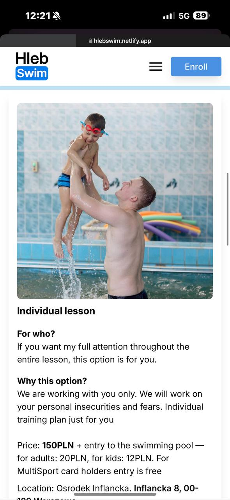
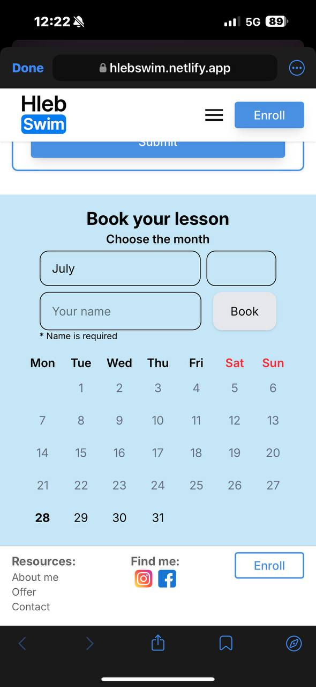

# 🏊 HlebSwim — Personal Instructor Website (React + Tailwind)

This is a professional one-page website for my swimming instruction services, built from scratch using **React**, **Vite**, and **Tailwind CSS**. It demonstrates responsive design, interactive UI logic, calendar booking functionality, and a clean component-based structure.

📍 [Live Demo →](https://hlebswim.netlify.app/)  
📁 [GitHub Repository](https://github.com/HlebBusko/HlebSwim_webSite)

---

## 🚀 Key Highlights

- **Fully Responsive SPA** — Designed for mobile-first performance and smooth UX
- **Modular Architecture** — Component-based structure using `useState`, `useRef`, conditional rendering
- **Interactive Booking Form** — With dynamic fields and real-time UI feedback
- **Custom Calendar** — Displays dynamic monthly availability, tracks bookings using JSON Server
- **Clean Deployment** — Built with Vite, deployed via Netlify, assets optimized and imports fixed for production

---

## 🧱 Tech Stack

- **Frontend:** React, Vite, Tailwind CSS
- **State Management:** React Hooks
- **UI Libraries:** `react-scroll`, `dayjs`, `clsx`
- **Mock Backend:** `json-server`
- **Deployment:** Netlify

---

## 💻 Local Setup

```bash
git clone https://github.com/HlebBusko/HlebSwim_webSite
cd Site
npm install
npm run dev
```

### Optional: Run mock backend for booking functionality

```bash
npx json-server --watch db.json --port 3000
```

---

## 📚 Project Objectives

- This project simulates a real-world freelance client scenario:

1. Designing a branded personal site with real-world UX expectations

2. Implementing time-based logic (calendar booking, date formatting)

3. Handling form validation, state persistence, and async data

4. Deploying to production and ensuring mobile compatibility

---

## 📸 Preview

### 🖥️ Desktop View





### 📱 Mobile View





## 🤝 About Me

I’m a professional swimming coach with a passion for coding. This project showcases my frontend capabilities and how I approach solving UI problems.

Feel free to explore the code — feedback welcome!

📧 Contact: [hleb.busko@gmail.com]
🌐 Portfolio:
📍 Based in Warsaw, Poland | Fluent in English & Polish. Native in Russian
